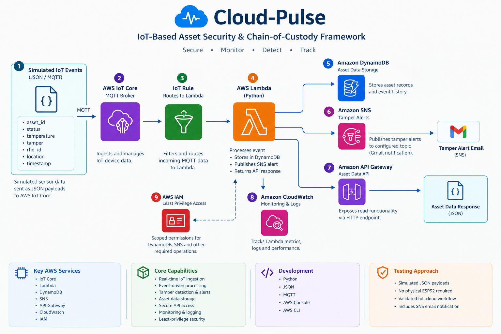
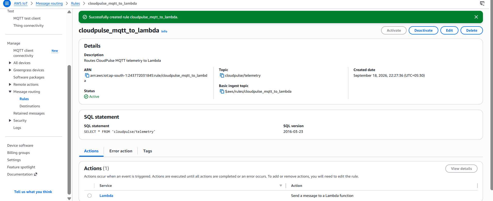
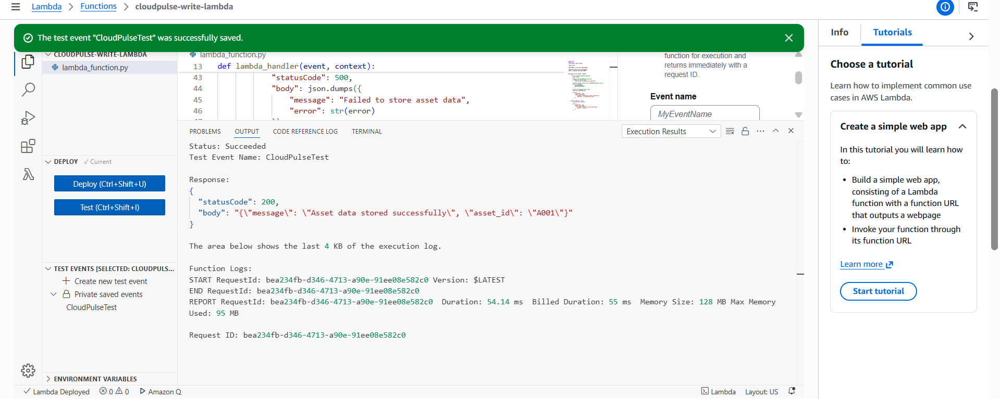
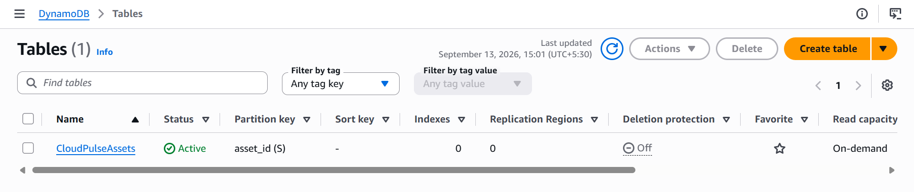
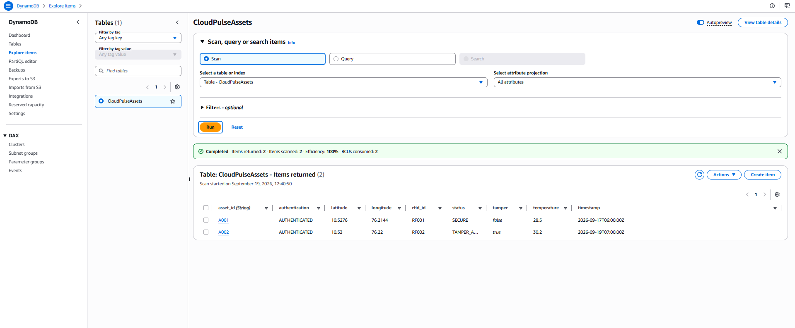
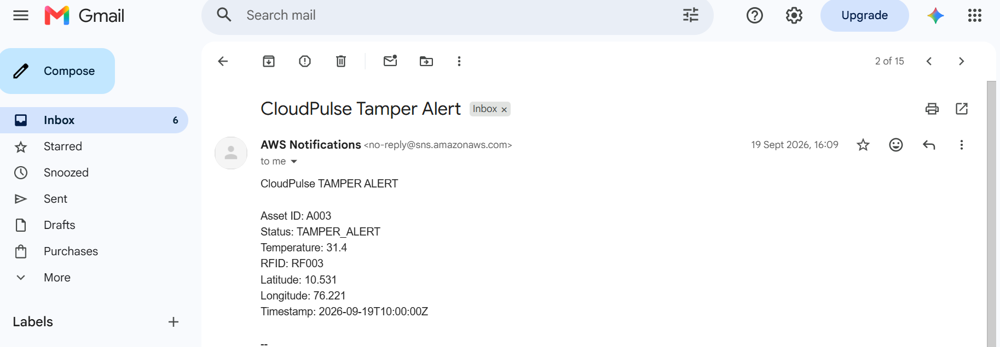
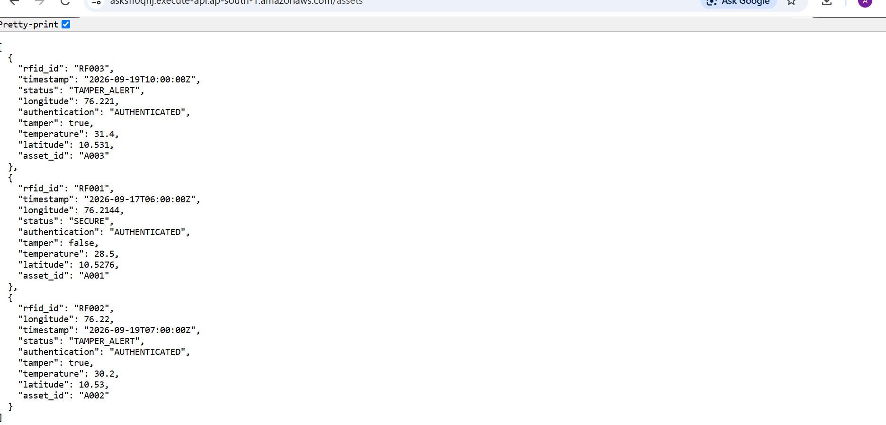
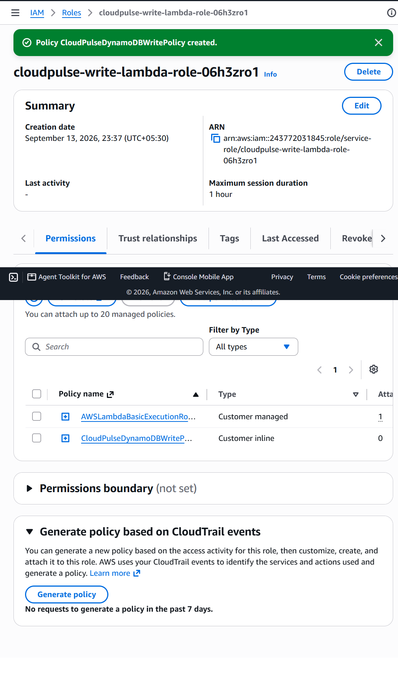
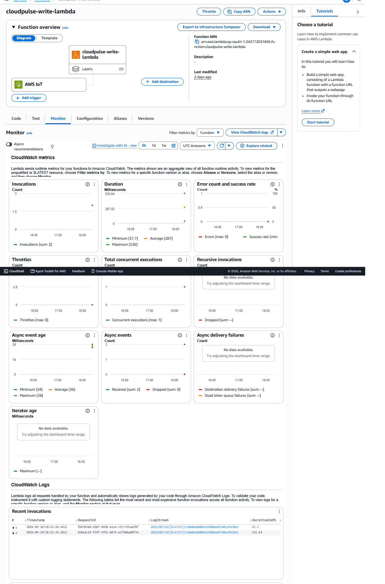

# Cloud-Pulse — IoT Asset Security & Chain-of-Custody (AWS Backend)


An event-driven AWS backend that receives IoT asset telemetry, detects tampering, stores asset state, sends email alerts, and serves data through an API, all on serverless services.

**In short**
- IoT Core receives MQTT telemetry and an IoT Rule routes it to a Python Lambda.
- The Lambda stores each asset's state in DynamoDB and, on a tamper event, publishes an SNS alert that arrives by email.
- A separate read Lambda behind API Gateway returns stored assets as JSON.
- Each Lambda has its own IAM role, and execution is monitored in CloudWatch.

The cloud backend was developed and validated with **simulated JSON/MQTT events**, independent of the physical sensor hardware.

---

## Architecture



```text
INGEST PATH
Simulated IoT event (JSON / MQTT)
        |
        v
AWS IoT Core  (topic: cloudpulse/telemetry)
        |
        v
IoT Rule  (cloudpulse_mqtt_to_lambda)
        |
        v
Write Lambda (Python)
     |            |
     v            v
 DynamoDB        SNS  --->  Tamper alert email
(asset state)   (only when tamper = true)

READ PATH
Client --> API Gateway (GET /assets) --> Read Lambda --> DynamoDB --> JSON response

OBSERVABILITY & SECURITY
CloudWatch: Lambda logs and metrics
IAM: separate role and policies per function
```

### Quick facts

| Item | Value |
|---|---|
| Region | ap-south-1 (Mumbai) |
| MQTT topic | `cloudpulse/telemetry` |
| IoT Rule SQL | `SELECT * FROM 'cloudpulse/telemetry'` |
| Table | `CloudPulseAssets` (partition key `asset_id`, on-demand capacity) |
| Runtime | Python on AWS Lambda |
| Test result | Write Lambda returned 200, about 54 ms, 128 MB |

---

## How each service is used

| Service | Role in the system |
|---|---|
| **AWS IoT Core** | MQTT entry point for asset events. An IoT Rule forwards each message to the write Lambda. |
| **AWS Lambda (write)** | Validates `asset_id`, converts numbers to DynamoDB `Decimal`, stores the item, checks the `tamper` flag, publishes an SNS alert when it is `true`, and returns a success or error response. |
| **AWS Lambda (read)** | Scans the table and returns the stored assets as JSON. |
| **Amazon DynamoDB** | Stores asset ID, status, temperature, tamper state, RFID ID, latitude, longitude and timestamp. |
| **Amazon SNS** | Publishes tamper alerts to an email subscription. |
| **Amazon API Gateway** | HTTP endpoint `/assets` that invokes the read Lambda. The table is never exposed directly. |
| **Amazon CloudWatch** | Lambda logs, invocation, duration and error metrics. |
| **AWS IAM** | One role per function, with only the actions each function needs. |

---

## Sample events

Normal reading:

```json
{
  "asset_id": "A001",
  "rfid_id": "RF001",
  "status": "SECURE",
  "authentication": "AUTHENTICATED",
  "tamper": false,
  "temperature": 28.5,
  "latitude": 10.5276,
  "longitude": 76.2144,
  "timestamp": "2026-09-17T06:00:00Z"
}
```

Tamper event (triggers the SNS alert):

```json
{
  "asset_id": "A002",
  "rfid_id": "RF002",
  "status": "TAMPER_ALERT",
  "authentication": "AUTHENTICATED",
  "tamper": true,
  "temperature": 30.2,
  "latitude": 10.53,
  "longitude": 76.22,
  "timestamp": "2026-09-19T07:00:00Z"
}
```

Write Lambda success response:

```json
{ "statusCode": 200, "body": "{\"message\": \"Asset data stored successfully\", \"asset_id\": \"A001\"}" }
```

---

## Security and IAM

Each function has its own role. The Lambda execution role combines AWS's standard logging policy with one custom policy for the single action it needs.

| Function | Permission | Resource |
|---|---|---|
| Write Lambda | `dynamodb:PutItem` | `CloudPulseAssets` table |
| Write Lambda | `sns:Publish` | CloudPulse SNS topic |
| Read Lambda | `dynamodb:Scan` | `CloudPulseAssets` table |
| Both | CloudWatch Logs (`AWSLambdaBasicExecutionRole`) | Lambda log groups |

The policy definitions are in [`iam/`](iam/).

---

## Implementation evidence

**IoT Rule routing MQTT to Lambda**



**Write Lambda test (status 200, asset stored)**



**DynamoDB table and stored records**




**SNS tamper alert received by email**



**API Gateway returning stored assets**



**IAM role for the write Lambda**



**CloudWatch Lambda metrics (invocations, 0 errors)**



---

## Design decisions

- **Serverless and event-driven.** There are no servers to manage, and each message triggers exactly one invocation.
- **Separate read and write functions.** Each gets only the permissions it needs, so the API cannot write or publish.
- **Simulated telemetry.** Testing the cloud with JSON events let the backend be built and validated without waiting on hardware.
- **DynamoDB on-demand.** Traffic is unpredictable and low, so there is no capacity to provision.

---

## Known limitations and roadmap

This is a validated prototype, not a production system. These are the known gaps:

| Limitation | Planned improvement |
|---|---|
| The table stores the **latest state per asset**, because `asset_id` is the only key. Earlier events are overwritten. | Add `timestamp` as a sort key to keep a full event history for chain-of-custody. |
| The `/assets` endpoint has **no authentication**. | Add an API key, IAM auth or a Cognito authorizer. |
| CloudWatch gives metrics and logs but **no alarms**. | Add alarms on Lambda errors and throttles. |
| Resources were created in the console. | Define the stack in Terraform or CloudFormation. |
| No dead-letter queue for failed events. | Add an SQS DLQ on the write Lambda. |
| Telemetry is simulated. | Connect a real ESP32 using an IoT Core device certificate. |

---

## Repository structure

```text
cloud-pulse/
├── README.md
├── docs/
│   ├── cloudpulse-architecture.png
│   └── screenshots/
├── lambda/
│   ├── cloudpulse-write-lambda.py
│   └── cloudpulse-read-lambda.py
└── iam/
    ├── dynamodb-read-policy.json
    ├── dynamodb-write-policy.json
    └── sns-publish-policy.json
```

---

## My contribution

I built the **AWS cloud/backend**: the IoT Core rule, both Python Lambda functions, the DynamoDB design, SNS tamper alerts, the API Gateway endpoint, per-function IAM policies and CloudWatch monitoring. I also designed the simulated test events used to validate the full workflow. The hardware and sensor layer was treated as a separate part of the project.

**Skills demonstrated:** AWS IoT Core, Lambda (Python), DynamoDB, SNS, API Gateway, IAM least privilege, CloudWatch, event-driven design.

---

## Author

**Anjana J** — Electronics & Communication Engineering, Jyothi Engineering College
Aspiring Cloud Engineer | AWS
GitHub: [Anjana-108](https://github.com/Anjana-108)
